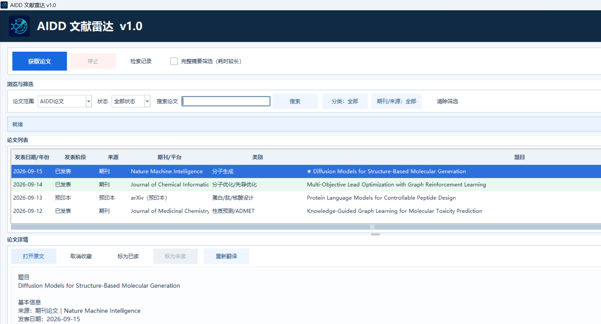
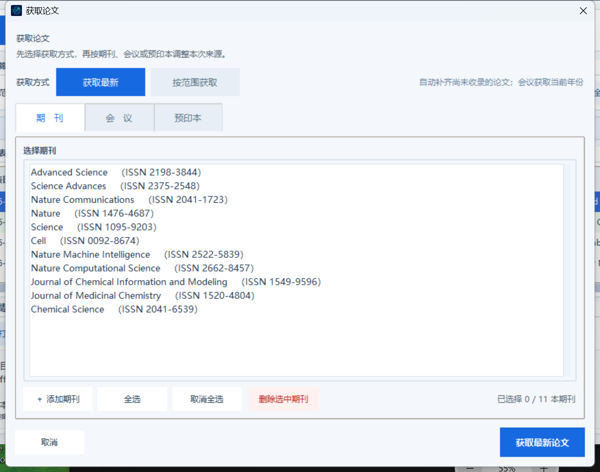
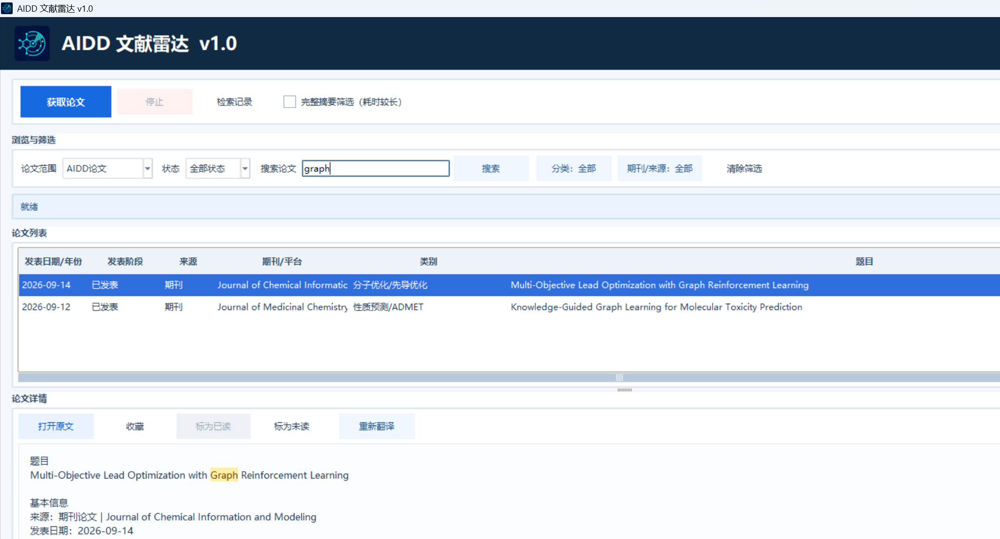
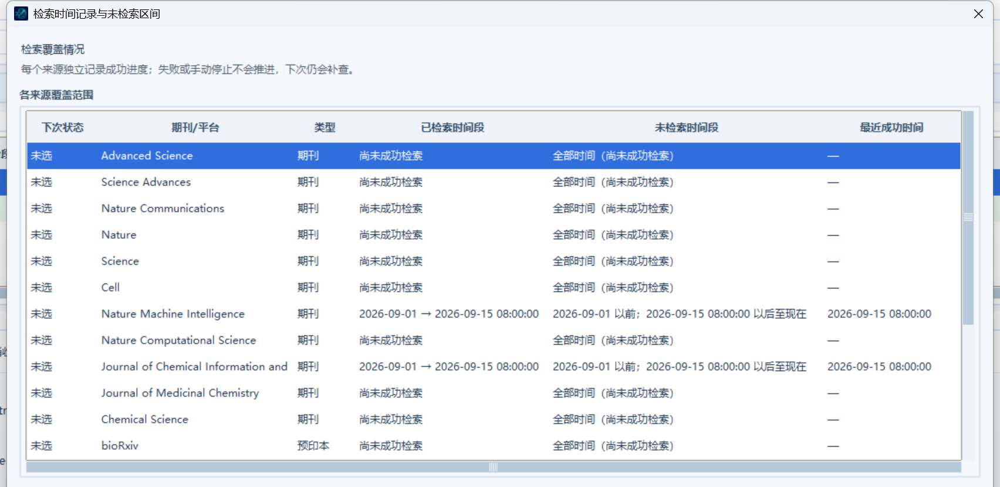

# AIDD 文献雷达 v1.0

面向 AI 药物研发研究者的 Windows 文献发现、筛选、去重与阅读管理工具。

> 本仓库仅用于发布可执行程序和使用说明，不提供源代码。

## 下载与安装

前往 [Releases](https://github.com/wenyulu21/AIDD-Literature-Radar/releases/latest) 下载 `AIDD-Literature-Radar-v1.0-Windows-x64.zip`。

1. 将 ZIP 完整解压到一个可写文件夹；
2. 双击 `AIDD文献雷达-v1.0.exe`；
3. 首次运行会在程序旁创建本地数据目录；
4. 点击“获取论文”，选择来源和时间范围后开始获取。

支持 64 位 Windows 10/11。程序暂未购买商业代码签名证书，Windows SmartScreen 可能显示“未知发布者”，请核对下载地址和校验值后运行。

截图使用演示数据，不包含个人论文库或阅读记录。

## 主要功能

- 期刊、会议、arXiv 与 bioRxiv 文献统一获取；
- 同时利用题目和摘要识别 AIDD 论文；
- 保存已选来源的全部基础文献记录，可切换查看 AIDD 或全部论文；
- 支持期刊 ASAP / online-first 元数据；
- 会议按年份获取，期刊和预印本按日期获取；
- DOI 优先去重，并关联预印本、会议版和正式期刊版；
- 中文摘要翻译与本地缓存；
- 搜索、分类、来源筛选、收藏、已读/未读和 CSV 导出；
- 每个来源分别记录获取进度，失败不会错误推进检查点。

## 使用方法

### 1. 获取论文

点击“获取论文”，选择“获取最新”或“按范围获取”。期刊、会议和预印本可分别选择；执行前软件会再次显示实际来源与范围。

“完整摘要筛选（耗时较长）”会尽量为范围内全部论文补充摘要。普通模式先保存完整的基础记录，只为 AIDD 宽松候选补充摘要，更适合日常使用。

### 2. 搜索和筛选

搜索不区分大小写，并支持单词中的连续片段。可以组合使用论文范围、阅读状态、分类和来源筛选。

### 3. 查看获取记录

获取记录按来源显示已经覆盖的时间范围、最近成功时间和运行结果。期刊、会议、bioRxiv 与 arXiv 分别维护进度。

## 本地数据与隐私

软件没有注册登录、遥测或云同步。论文元数据、中文摘要、收藏、阅读状态、获取进度和排除记录均保存在程序旁的本地数据库中。升级或移动软件时，请一并保留 `data` 文件夹。

## 使用许可

本软件不是开源软件，也不使用 MIT 许可证。仅允许下载者将官方发布的可执行版本用于个人、非商业的学习和科研。未经书面许可，不得复制传播、重新发布、销售、出租、修改、反编译、反汇编、逆向工程，或将其用于商业服务。完整条款见 [软件使用许可](LICENSE.txt)。

第三方论文元数据、摘要和原文仍受各来源平台及出版商条款约束。

## 联系方式

如有任何问题，欢迎联系我：[wenyulu21@163.com](mailto:wenyulu21@163.com)。

